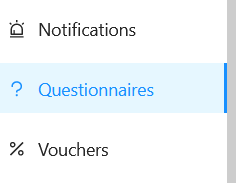
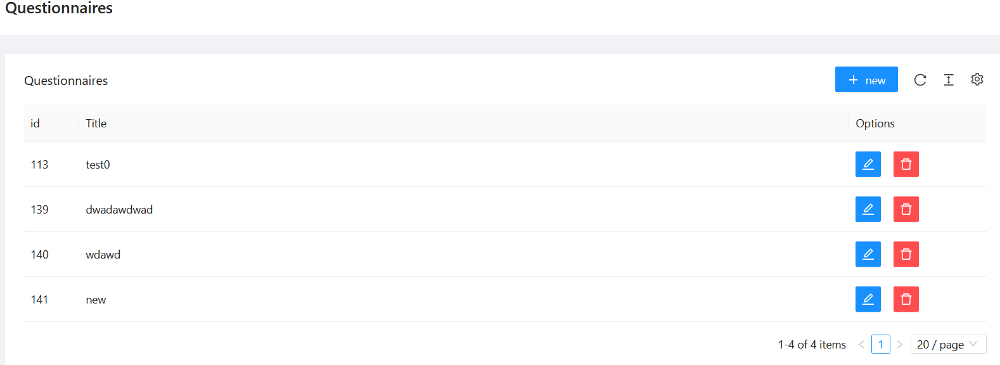
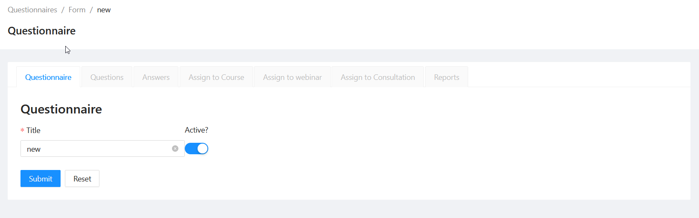
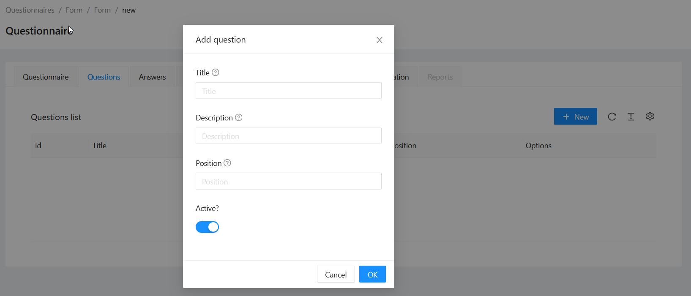
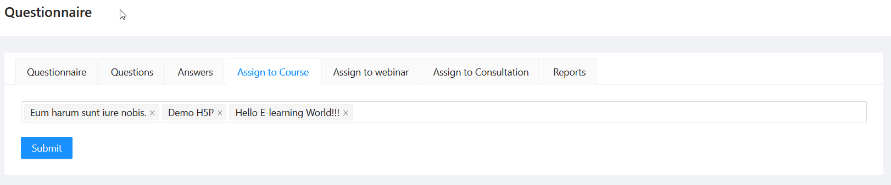
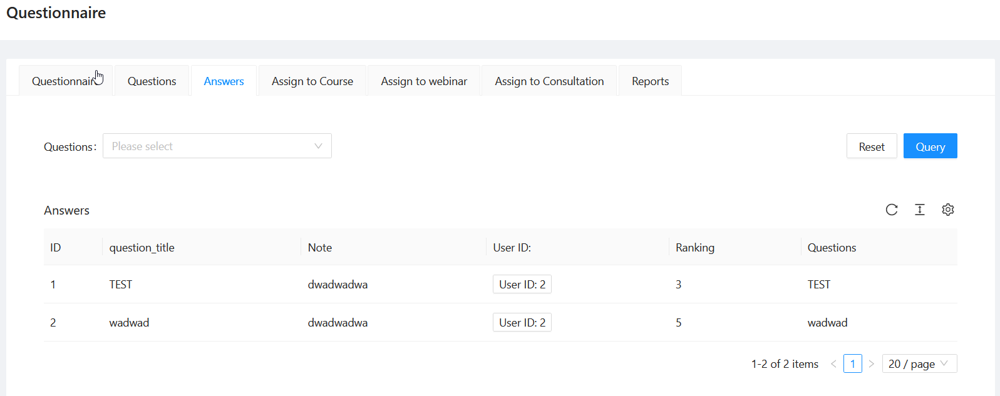
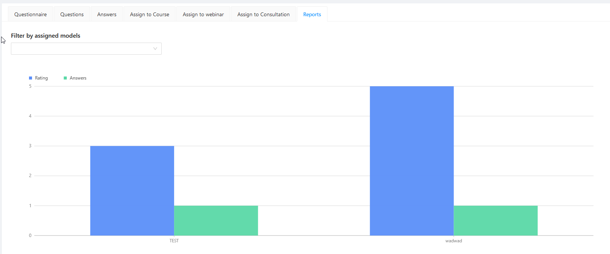

# Questionnaire

Questionnaire package

[](https://escolalms.github.io/Questionnaire/)
[](https://codecov.io/gh/EscolaLMS/questionnaire)
[](https://github.com/EscolaLMS/questionnaire/actions/workflows/test.yml)
[](https://packagist.org/packages/escolalms/questionnaire)
[](https://packagist.org/packages/escolalms/questionnaire)
[](https://packagist.org/packages/escolalms/questionnaire)

## What does it do

This package is used for creating Questionnaire for EscolaLms.

## Installing

- `composer require escolalms/questionnaire`
- `php artisan migrate`
- `php artisan db:seed --class="EscolaLms\Questionnaire\Database\Seeders\QuestionnairePermissionsSeeder"`

## Endpoints

All the endpoints are defined in [](https://escolalms.github.io/Questionnaire/)

## Tests

Run `./vendor/bin/phpunit` to run tests. See [tests](tests) folder as it's quite good staring point as documentation appendix.

Test details [](https://codecov.io/gh/EscolaLMS/questionnaire) [](https://github.com/EscolaLMS/questionnaire/actions/workflows/test.yml)

## Events

This package does not dispatch any events.

## Listeners

This package does not listen for any events

## How to use this on frontend.

### Admin panel

**Left menu**



**List of questionnaire**



**Creating/editing questionnaire**



**Creating/editing question**



**Assign questionnaire to Course**



**List of Answers**



**Report**



### Front Application

...

## Permissions

Permissions are defined in [seeder](packages/questionnaire/database/seeders/QuestionnairePermissionsSeeder.php)

## Database relation

1. `Questionnaires` general Questionnaire (Title) is related to Questionnaire_models
2. `Questionnaire_models` Questionnaire model belong to model type and model id
3. `Questionnaire_model_types` Model Type (Curse, Webinar etc.)
4. `Questions` Question belong to Questionnaire
5. `Question_answers` Question answer is related to Question and Questionnaire_models

```
Questionnaires 1 -> n Questionnaire_models
Questionnaires 1 -> n Questions
Questionnaire_models 1 -> n Questionnaire_model_types
Question_answers 1 -> n Questions
Question_answers 1 -> n Questionnaire_models
```

To add new model type you need to insert new record to `Questionnaire_model_types`

```
title -> Title of model (example - 'Course')
model_class => Model class name (example 'EscolaLms\Courses\Models\Course')
```
